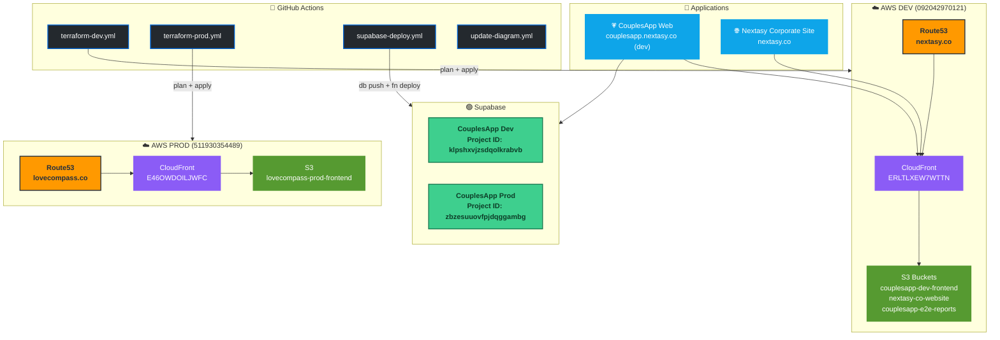

# nextasyapps-infra

Infrastructure as Code for **Nextasy** — managed with Terraform, Supabase CLI, and GitHub Actions.

> ⚡ The architecture diagrams below are **automatically updated** on every infrastructure change via GitHub Actions.

---

## 🗺️ Architecture Overview


```

---

## Repository Structure

```
nextasyapps-infra/
├── terraform/
│   ├── environments/
│   │   ├── dev/                  # DEV environment (092042970121)
│   │   │   ├── main.tf           # CouplesApp frontend (S3+CF module + Route53)
│   │   │   ├── nextasy-web.tf    # Nextasy corporate site (S3+CF module)
│   │   │   ├── e2e-reports.tf    # E2E reports S3 bucket + CloudFront
│   │   │   ├── dns.tf            # All Route53 records (A, CNAME, MX, SPF, DKIM, ACM)
│   │   │   ├── supabase.tf       # Supabase dev + prod projects
│   │   │   ├── provider.tf       # AWS + Supabase providers, S3 backend
│   │   │   ├── variables.tf      # Input variables
│   │   │   └── outputs.tf        # Output values
│   │   └── prod/                 # PROD environment (511930354489)
│   │       ├── main.tf           # LoveCompass (S3+CF+Route53+DNS)
│   │       ├── backend.tf        # S3 backend (nextasy-terraform-state-prod)
│   │       ├── provider.tf       # AWS provider
│   │       ├── variables.tf      # Input variables
│   │       └── outputs.tf        # Output values
│   └── modules/
│       ├── s3-spa/               # Reusable S3 + CloudFront SPA module
│       └── supabase-project/     # Reusable Supabase project module
├── supabase/
│   ├── migrations/               # SQL migrations (applied via supabase-deploy.yml)
│   │   ├── 001_initial_schema.sql
│   │   ├── 002_calendar_integration.sql
│   │   ├── 003_dating_ideas.sql
│   │   ├── 004_fix_profiles_rls_recursion.sql
│   │   └── 005_daily_questions.sql
│   └── functions/
│       └── generate-date-ideas/  # OpenAI-powered date suggestions
└── .github/workflows/
    ├── terraform-dev.yml         # Terraform plan + apply (DEV)
    ├── terraform-prod.yml        # Terraform plan + apply (PROD)
    ├── supabase-deploy.yml       # DB migrations + Edge Functions
    └── update-diagram.yml        # Auto-update architecture diagram
```

---

## Environments

| Environment | AWS Account | Supabase Project | Domain | State Bucket |
|-------------|-------------|-----------------|--------|-------------|
| **dev** | `092042970121` | `klpshxvjzsdqolkrabvb` | `couplesapp.nextasy.co` | `nextasyapps-terraform-state-dev` |
| **prod** | `511930354489` | `zbzesuuovfpjdqggambg` | `lovecompass.co` | `nextasy-terraform-state-prod` |

---

## GitHub Actions Secrets Required

| Secret | Used By | Environment |
|--------|---------|-------------|
| `AWS_ACCESS_KEY_ID` | terraform-dev | DEV |
| `AWS_SECRET_ACCESS_KEY` | terraform-dev | DEV |
| `PROD_AWS_ACCESS_KEY_ID` | terraform-prod | PROD |
| `PROD_AWS_SECRET_ACCESS_KEY` | terraform-prod | PROD |
| `SUPABASE_ACCESS_TOKEN` | supabase-deploy, terraform-dev | Both |
| `SUPABASE_DEV_PROJECT_REF` | supabase-deploy | DEV |
| `SUPABASE_PROD_PROJECT_REF` | supabase-deploy | PROD |
| `TF_VAR_SUPABASE_DEV_DB_PASSWORD` | terraform-dev | DEV |
| `TF_VAR_SUPABASE_PROD_DB_PASSWORD` | terraform-dev | DEV |
| `TF_VAR_SUPABASE_ORG_ID` | terraform-dev | DEV |
| `TF_VAR_ACM_CERTIFICATE_ARN` | terraform-dev | DEV |
| `OPENAI_API_KEY` | update-diagram | — |

---

## Deployed Resources

### DEV — AWS Account 092042970121

| Resource | ID / Name | Purpose |
|----------|-----------|---------|
| CloudFront | `ERLTLXEW7WTTN` | CouplesApp web (couplesapp.nextasy.co) |
| CloudFront | `E640UP3DK37WP` | Nextasy website (nextasy.co) |
| CloudFront | `EYJ1QFLZNTBP` | E2E reports |
| S3 | `couplesapp-dev-frontend` | CouplesApp React SPA |
| S3 | `nextasy-co-website` | nextasy.co corporate site |
| S3 | `couplesapp-e2e-reports` | E2E test reports |
| Route53 | `Z02633611RLKX976F44TP` | nextasy.co hosted zone |

### PROD — AWS Account 511930354489

| Resource | ID / Name | Purpose |
|----------|-----------|---------|
| CloudFront | `E46OWDOILJWFC` | LoveCompass web (lovecompass.co) |
| S3 | `lovecompass-prod-frontend` | LoveCompass React SPA |
| Route53 | `Z0581410V8FQJTMVTXVI` | lovecompass.co hosted zone |

---

*Diagram last updated: 2026-03-08 — auto-maintained by [update-diagram.yml](.github/workflows/update-diagram.yml)*
