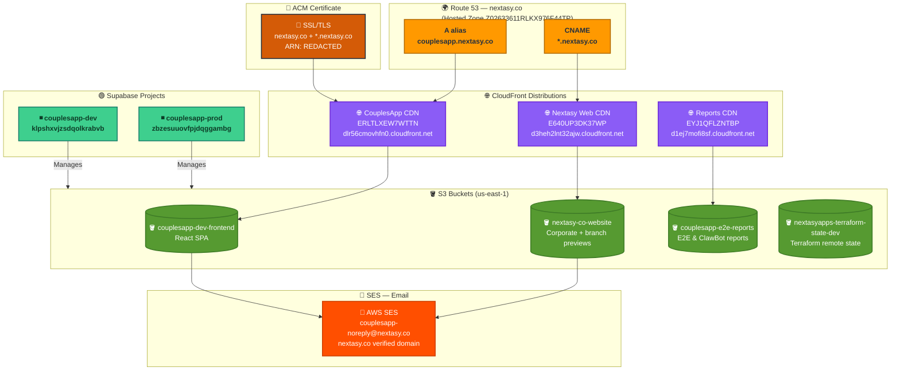

# nextasyapps-infra

Infrastructure as Code for **Nextasy** — managed with Terraform, Supabase CLI, and GitHub Actions.

> ⚡ The architecture diagrams below are **automatically updated** on every infrastructure change via GitHub Actions.

---

## 🗺️ Architecture Overview

Five focused diagrams — each styled to its brand — give you a complete picture of the infrastructure at every level of detail.

---

### Diagram 1 — 10,000-foot View

High-level view of how all the moving parts relate to each other.


```

---

### Diagram 2 — GitHub Repos & CI/CD

Source code repositories, workflows, and the automation that keeps everything running.


```

---

### Diagram 3 — Supabase Detail

Database schema, Edge Functions, scheduled crons, and auth configuration for dev & prod.


```

---

### Diagram 4 — AWS Infrastructure (Dev)

Full AWS topology for the dev environment — DNS, CDN, storage, email, and certificates.


```

---

### Diagram 5 — AWS Infrastructure (Prod)

Production environment — live at couplesapp.nextasy.co (deployed 2026-03-05).


```

---

## Repository Structure

```
nextasyapps-infra/
├── terraform/
│   ├── environments/
│   │   └── dev/
│   │       ├── main.tf           # CouplesApp frontend (S3 + CloudFront + Route 53)
│   │       ├── nextasy-web.tf    # Nextasy corporate site
│   │       ├── e2e-reports.tf    # E2E & reports S3 bucket
│   │       ├── supabase.tf       # Supabase dev + prod projects
│   │       ├── backend.tf        # Remote state (S3 + DynamoDB)
│   │       └── variables.tf
│   └── modules/
│       ├── s3-spa/               # Reusable S3 + CloudFront SPA module
│       └── supabase-project/     # Reusable Supabase project module
├── supabase/
│   ├── migrations/
│   │   ├── 001_initial_schema.sql
│   │   ├── 002_calendar_integration.sql
│   │   ├── 003_dating_ideas.sql
│   │   └── 004_fix_profiles_rls_recursion.sql
│   └── functions/
│       └── generate-date-ideas/  # OpenAI-powered date suggestions
└── .github/workflows/
    ├── terraform-dev.yml         # Terraform plan + apply
    ├── supabase-deploy.yml       # DB migrations + Edge Functions
    └── update-diagram.yml        # Auto-update architecture diagram
```

---

## Environments

| Environment | AWS Account | Supabase Project | Domain |
|-------------|-------------|-----------------|--------|
| **dev** | `AWS_ACCOUNT_ID_REDACTED` | `klpshxvjzsdqolkrabvb` | `couplesapp.nextasy.co` |
| **prod** | `511930354489` | `zbzesuuovfpjdqggambg` | _(pending)_ |

---

## GitHub Actions Secrets Required

| Secret | Used By |
|--------|---------|
| `AWS_ACCESS_KEY_ID` | terraform-dev, update-diagram |
| `AWS_SECRET_ACCESS_KEY` | terraform-dev, update-diagram |
| `SUPABASE_ACCESS_TOKEN` | supabase-deploy, update-diagram |
| `SUPABASE_DEV_PROJECT_REF` | supabase-deploy |
| `SUPABASE_PROD_PROJECT_REF` | supabase-deploy |
| `TF_VAR_SUPABASE_DEV_DB_PASSWORD` | terraform-dev |
| `TF_VAR_SUPABASE_PROD_DB_PASSWORD` | terraform-dev |
| `TF_VAR_SUPABASE_ORG_ID` | terraform-dev |
| `ANTHROPIC_API_KEY` | update-diagram |

---

## Deployed Resources

### CloudFront Distributions

| ID | Domain | Origin | Purpose |
|----|--------|--------|---------|
| `ERLTLXEW7WTTN` | `dlr56cmovhfn0.cloudfront.net` | `couplesapp-dev-frontend` | CouplesApp web |
| `E640UP3DK37WP` | `d3heh2lnt32ajw.cloudfront.net` | `nextasy-co-website` | Nextasy website |
| `EYJ1QFLZNTBP` | `d1ej7mofi8sf.cloudfront.net` | `couplesapp-e2e-reports` | E2E + reports |

### S3 Buckets

| Bucket | Region | Purpose |
|--------|--------|---------|
| `couplesapp-dev-frontend` | us-east-1 | CouplesApp React SPA |
| `nextasy-co-website` | us-east-1 | nextasy.co + branch previews |
| `couplesapp-e2e-reports` | us-east-1 | E2E nightly + ClawBot reports |
| `nextasyapps-terraform-state-dev` | us-east-1 | Terraform remote state |

---

*Diagrams last updated: 2026-03-05 — auto-maintained by [update-diagram.yml](.github/workflows/update-diagram.yml)*
